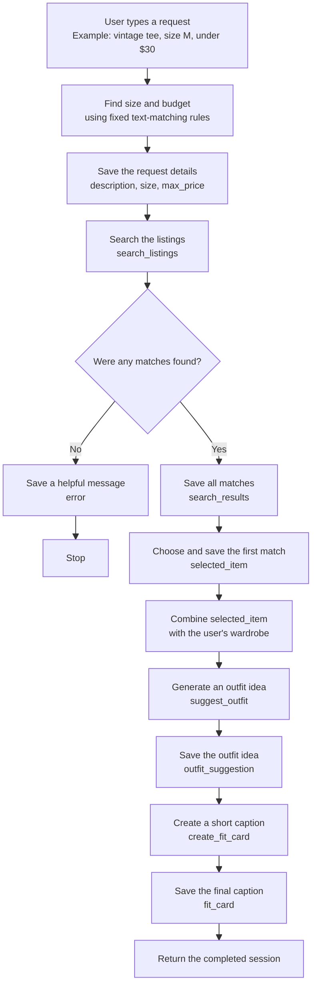

# FitFindr

> ### 👋 Start here
>
> **New to this repo? Read [RUNNING.md](RUNNING.md) first** - setup, every
> command, and what to do when something breaks.
>
> Once `python test.py` passes:
>
> ```bash
> python app.py listings --full -n 6      # read the data (Milestone 1)
> python app.py fields                    # what you can filter on
> python app.py ask 'vintage graphic tee under $30'
> ```
>
> All three tools are stubs, so that last command will do nothing useful yet.
> That's the starting position.
>
> **The rest of this file is your submission.** Fill it in as you go.

---

<!-- ─────────────────────────────────────────────────────────────────────────
     HOW TO USE THIS FILE

     This is your submission. Fill each section in as you finish the milestone
     it belongs to - don't leave it all to the end.

     Unit 3 asks for the first five sections. Unit 4 adds the five below them.
     Leave the unit 4 sections alone until then; they're here so you know
     what's coming.

     Everything is pasted as TEXT. No screenshots, no images, no video links.
     A typed block of output gets full credit; a picture of the same output
     gets none.
     ───────────────────────────────────────────────────────────────────────── -->

<!-- ═══════════════════════ UNIT 3 - THE BUILD ═══════════════════════ -->

## What This Does

<!-- Three or four sentences: what a user asks for, and what they get back. -->

FitFindr helps a user search secondhand clothing listings by describing what
they want and optionally including a size and maximum price. The agent parses
the request, searches the listings, and selects the best matching item. When a
match is found, it uses the user's wardrobe to suggest an outfit and creates a
short fit-card caption that includes the item's price and platform. If nothing
matches, it tells the user what they can change in their search and stops before
running the outfit and fit-card tools.

---

## Tool Inventory

<!-- Four lines per tool. This is worth 2 points and it's the single most
     common place students lose them.

     "Returns a list" earns NOTHING. The description has to say what is IN
     the list.

     The empty case isn't optional either - it's the thing your loop branches
     on, and if you don't decide it here you'll discover it as a crash in
     Milestone 5. -->

### `search_listings`

- **What it does:** Searches the local listings for description keywords, then optionally filters the results by size and an inclusive maximum price without calling the model.
- **Inputs:** 
  - `description` (`str`) contains the requested item keywords;
  -  `size` (`str | None`) is an optional, case-insensitive size filter; 
  -  `max_price` (`float | None`) is an optional inclusive price ceiling. Letter sizes are matched as complete size options, so `M` matches `S/M` but does not match `XL` or the `S` in `US 9`.
- **Returns:**
  -  A `list[dict]` of matching listings ordered from best keyword match to worst.
  -  Each listing includes `id`, `title`, `description`, `category`, `style_tags`, `size`, `condition`, `price`, `colors`, `brand`, and `platform`.
- **When it has nothing:** Returns an empty list (`[]`), rather than `None` or an exception.

### `suggest_outfit`

- **What it does:** Uses the selected thrift listing and the user's wardrobe to generate one or two outfit ideas, naming pieces the user already owns when they are available.
- **Inputs:**
  - `new_item` (`dict`) is the complete listing record for the item the user is considering.
  - `wardrobe` (`dict`) contains an `items` key whose value is a `list[dict]` of saved wardrobe pieces; the list may be empty.
- **Returns:** A non-empty `str` containing one or two outfit suggestions built around `new_item` and, when possible, specific pieces from the user's wardrobe.
- **When it has nothing:** If `wardrobe["items"]` is empty, it returns non-empty general styling advice for `new_item` instead of raising an error or returning an empty string.

### `create_fit_card`

- **What it does:** Turns an outfit suggestion and its thrift listing into a short, social-media-style caption with a specific fashion vibe.
- **Inputs:**
  - `outfit` (`str`) is the suggestion produced by `suggest_outfit`.
  - `new_item` (`dict`) is the complete listing record for the selected thrift item.
- **Returns:** A `str` containing a two-to-four-sentence caption that mentions the item, its price, and its platform once each and incorporates the suggested outfit.
- **When it has nothing:** If `outfit` is empty or contains only whitespace, it returns a descriptive message instead of raising an error or attempting to create a caption.

---

## Planning Loop

<!-- Your branch rule, stated as a rule - the condition AND both paths - plus
     the file and function that holds it.

     Like this:
       "If search_listings returns an empty list, put a message in the session
        and stop. Otherwise take the first result and go to suggest_outfit."
        - agent.py::run_agent

     The grader checks your code against what you claim here, so the file and
     function have to be real. -->

**Branch rule:** If `search_listings` returns an empty list, store an actionable message in `session["error"]` and stop. Otherwise, store the first result in `session["selected_item"]` and continue to `suggest_outfit`.

**Where it lives:** `agent.py::run_agent`

**How the query is parsed:** The program uses regular expressions (text-matching patterns) to find a size and a budget in the user's request. For example, it reads `size M` as the size and `under $30` as the maximum price. It removes those parts, then uses the words left over as the item description. This step follows fixed rules and does not use the AI model.

**What moves through the session:** The session is the shared record of one request. It first saves what the user typed (`query`) and the three details taken from it (`description`, `size`, and `max_price` inside `parsed`). Next it saves the matching listings (`search_results`) and chooses the first one (`selected_item`). The selected item and the user's wardrobe are used to save an outfit idea (`outfit_suggestion`), and that idea becomes the final caption (`fit_card`). If there are no matching listings, the session saves a helpful message (`error`) and stops before creating an outfit or caption.



---

## Sample Run

<!-- Two things go here.

     1. One FULL query and its output, pasted as text.
     2. Your three per-tool terminal tests - the command and what it printed. -->

**One full query**

```
$ .\.venv\Scripts\python.exe app.py ask 'vintage graphic tee size M under $30'

  Found:    Y2K Baby Tee - Butterfly Print - $18.0 on depop

  Outfit:   Outfit 1:
- Top: Y2K Baby Tee - Butterfly Print
- Bottoms: Baggy straight-leg jeans, dark wash
- Shoes: Chunky white sneakers
- Accessories: Black crossbody bag

Why it works: The fitted crop of the baby tee balances the volume of the baggy dark-wash jeans, creating a classic Y2K proportion. The pink and purple butterfly graphic ties into the streetwear aesthetic of the sneakers and bag.

Outfit 2:
- Top: Y2K Baby Tee - Butterfly Print
- Outerwear: Vintage black denim jacket
- Bottoms: Wide-leg khaki trousers
- Shoes: Black combat boots
- Accessories: Brown leather belt

Why it works: Layering the slightly cropped black denim jacket over the baby tee brings out the Y2K vibe while contrasting against the minimal khaki trousers. The combat boots add an edgy contrast to the soft butterfly graphic.

  Fit card: Channel total early-2000s energy by styling this Y2K butterfly baby tee with baggy dark-wash jeans and chunky white sneakers for the ultimate nostalgic streetwear look. Available now for $18.00 on depop, this fitted gem adds a sweet pop of color to any casual rotation.

0 model calls this session, 2 served from cache
```

**The three tools, tested one at a time**

```
$ .\.venv\Scripts\python.exe -c "from tools import search_listings; print([(item['title'], item['price']) for item in search_listings('graphic tee', max_price=30)])"
[('Y2K Baby Tee - Butterfly Print', 18.0), ('Graphic Tee - 2003 Tour Bootleg Style', 24.0), ('Mesh Long-Sleeve Top - Black', 15.0), ('Vintage Band Tee - Faded Grey', 19.0), ('Low-Rise Cargo Pants - Khaki', 27.0), ('Oversized Crewneck Sweatshirt - Vintage Navy', 20.0), ('Vintage Graphic Hoodie - Faded Black', 26.0)]
```

```
$ .\.venv\Scripts\python.exe -c "from tools import suggest_outfit; from utils.data_loader import get_example_wardrobe, load_listings; print(' '.join(suggest_outfit(load_listings()[0], get_example_wardrobe()).split()))"
Outfit 1: - Bottoms: Vintage Levi's 501 Jeans - Medium Wash - Tops: White ribbed tank top - Outerwear: Vintage black denim jacket - Shoes: Chunky white sneakers - Accessories: Black crossbody bag Why it works: The medium wash of the Levi's pairs effortlessly with the crisp white tank for a classic, minimal base. Adding the slightly cropped black denim jacket introduces a cool double-denim contrast without clashing, while the chunky white sneakers and black crossbody bag tie the streetwear aesthetic together. Outfit 2: - Bottoms: Vintage Levi's 501 Jeans - Medium Wash - Tops: Oversized grey crewneck sweatshirt - Shoes: Black combat boots - Accessories: Brown leather belt Why it works: The straight-leg fit of the 501s balances the heavy, hip-dropping proportions of the oversized grey crewneck. Tucking the front of the sweatshirt in with the brown leather belt adds definition, and the black combat boots ground the look with a touch of grunge edge.
```

```
$ .\.venv\Scripts\python.exe -c "from tools import create_fit_card; from utils.data_loader import load_listings; print(' '.join(create_fit_card('jeans and white sneakers', load_listings()[0]).split()))"
Channel effortless streetwear energy with these vintage Levi's 501 jeans, featuring a perfectly faded medium wash that screams authentic retro cool. Pair them with crisp white sneakers for an easy, everyday look that never misses. You can grab this timeless wardrobe staple on depop for just $38.00.
```

---

## How I Used AI

<!-- Two specific moments. What you asked, what came back, what you changed.

     "I used Claude to help me code" is not enough.

     "I gave Claude my search_listings spec. It returned None on no match
     instead of an empty list, so I changed it" is the level we want. -->

**Moment 1**

- *What I asked for:* I showed Codex my tool
  contract and the different size formats in the data, including `M`, `S/M`,
  `XL`, `US 8`, `US 8.5`, and `W30 L30`. I asked how to make matching ignore
  capitalization without accidentally letting size `S` match the `S` in
  `US 9`, or size `L` match `XL`.
- *What came back:* Codex explained that a simple check such as
  `requested_size in listing_size` would quietly return incorrect sizes. It
  recommended converting sizes to a consistent format and matching complete
  size options instead of individual letters. It also recommended cleaning the
  description into useful keywords, applying the price and size filters before
  scoring, ranking listings by the number of matching keywords, and returning
  exactly `[]` when nothing matches.
- *What I changed:* I added `_size_matches()` to handle letter, shoe, and waist
  sizes without partial-letter mistakes. I added `_keyword_tokens()` to ignore
  capitalization, punctuation, filler words, and simple plural differences.
  The search now removes over-budget and wrong-size listings first, ranks the
  remaining listings, and returns the original listing dictionaries in order.
  I tested `S`, `M`, `US 8`, a maximum price, and an impossible search. These
  changes help because the user now gets results that actually respect their
  filters, and the agent receives a dependable empty list when it needs to stop.

**Moment 2**

- *What I asked for:* I asked Codex how to
  connect the three tools so the agent would continue after a successful search
  but stop after an empty search. I also asked how to keep the selected item and
  every later result visible so I could check that the same item moved through
  the whole workflow.
- *What came back:* Codex suggested using a `next_step` value to track which
  part of the workflow should run, plus an iteration counter to stop a broken
  loop from repeating forever. It suggested using regular expressions, which
  are fixed text-matching rules, to separate the item description, size, and
  maximum price without spending a model call. It also recommended saving each
  result in the session and returning early with a useful message if search
  returns `[]`.
- *What I changed:* I added `_parse_query()` so a request such as
  `vintage tee size M under $30` becomes a description, size `M`, and maximum
  price `30.0`. I built a bounded planning loop that saves `search_results`,
  `selected_item`, `outfit_suggestion`, and `fit_card` in the session, and each
  tool reads its input back from that shared session. For the empty branch, I
  added a message telling the user to broaden the keywords, remove the size, or
  increase the budget, then stopped before either model-powered tool ran. I
  tested both paths: the happy path completed all three tools with the same item
  ID, while the empty path left `fit_card` as `None` and made zero model calls.
  This makes the agent's decisions visible, testable, and less likely to waste
  API requests.

### Unit 4 update

**Moment 3**

- *What I asked for:* I asked Codex to help me make the planning loop visible
  after moving `search_listings` behind MCP. I also asked how to test an empty
  search, an empty wardrobe, and an unavailable model without letting one
  failure trigger tools that no longer had valid input.
- *What came back:* Codex recommended tracing the input and output of each
  planning step, showing that search crossed MCP, and recording why the loop
  stopped. It explained that an empty search should stop before
  `suggest_outfit`, while a model error during `suggest_outfit` should stop
  before `create_fit_card`.
- *What I changed:* I added trace entries for parsing, MCP search, item
  selection, outfit generation, and fit-card creation. I also caught
  `ModelUnavailable` around both model-powered tools and saved a readable error
  in the session. I ran all three failure paths and pasted the real output into
  the README. This let me prove that the happy path has five steps while the
  empty and failed paths stop at the correct point.

**Moment 4**

- *What I asked for:* I changed one character in my Gemini API key to test the
  model-unavailable path, but the agent still returned an outfit. I asked
  Codex why the bad key did not cause a failure and what `served from cache`
  meant.
- *What came back:* Codex explained that the project saves model responses for
  repeated prompts. When the same prompt is used again, the saved response is
  returned without contacting Gemini, so the invalid key is never checked. It
  also explained that a key already set in the PowerShell environment can take
  priority over the value in `.env`.
- *What I changed:* I disabled the response cache for one test process, used a
  temporary invalid key, and ran a matching query so the loop had to reach
  `suggest_outfit`. The trace showed parsing, MCP search, and item selection,
  followed by `model unavailable, stopping`. The agent displayed a readable
  API-key message, did not call `create_fit_card`, and did not show a raw stack
  trace. The temporary environment values ended with the test, so my real key
  in `.env` was not changed or exposed.

  **Moment 5**

- *What I asked for:* I asked Codex to add tracing to `agent.py` and include
  comments that would help me understand the planning loop.
- *What came back:* The first version worked, but it added a long explanation
  beside almost every assignment and branch. The comments repeated what the
  code already said, which made the loop harder for me to scan and understand.
  It met the tracing requirement but did not meet my readability goal.
- *What I changed:* I asked Codex to simplify the explanation and reorganize
  the code. I kept one short comment showing the overall flow, used brief
  comments only where they explain *why* something happens, and moved the MCP
  search-trace formatting into `_record_search_trace()`. The final loop still
  records all five steps and the failure branches, but the control flow is much
  easier to follow. I reran the happy, empty-search, empty-wardrobe, and
  model-unavailable paths to make sure the readability refactor did not change
  the behavior.

<!-- ═══════════════════════ UNIT 4 - THE TEST ═══════════════════════

     Don't fill these in during unit 3.
     ═══════════════════════════════════════════════════════════════════ -->

---

## Run Log - Before

<!-- Five criteria, five tries each, in this exact format.

     Five, because your criteria are written out of five. Mark each try PASS
     or FAIL, count the passes, and read that count against your target - a
     row targeting 4 of 5 with three PASS cells is MISSED (3/5).

     `python run_eval.py --label before` runs everything and writes the table
     into results/. Paste it here and fill in the verdicts. -->

| Criterion | Target | Try 1 | Try 2 | Try 3 | Try 4 | Try 5 | Verdict |
|---|---|---|---|---|---|---|---|
| 1. Matching query completes all three tools | At least 4 of 5 | PASS | PASS | PASS | PASS | PASS | MET - 5/5 |
| 2. Impossible query stops before the second tool | 5 of 5 | PASS | PASS | PASS | PASS | PASS | MET - 5/5 |
| 3. Selected listing moves through the session unchanged | 5 of 5 | PASS | PASS | PASS | PASS | PASS | MET - 5/5 |
| 4. Fit card includes essential details and stays caption-sized | At least 4 of 5 | PASS | PASS | PASS | PASS | PASS | MET - 5/5 |
| 5. Search always respects the user's maximum price | 5 of 5 | PASS | PASS | PASS | PASS | PASS | MET - 5/5 |

**Real output for each criterion**, using one try from each scenario and pasted as actual text:

Source: `results/run_2026-10-08_2336_before.md`, produced by `run_eval.py::main` using the loop in `agent.py::run_agent`.

Each excerpt below is Try 1 from its named scenario. The committed results file contains all five tries for every criterion.

### Criterion 1 - Matching query completes all three tools

**Try 1**

- stopped early: no
- selected_item: Y2K Baby Tee - Butterfly Print ($18.0, depop)
- search_results: 10

Outfit suggestion:

```
Outfit 1:
- Top: Y2K Baby Tee - Butterfly Print
- Bottoms: Baggy straight-leg jeans, dark wash
- Shoes: Chunky white sneakers
- Accessories: Black crossbody bag

Why it works: The fitted crop length of the baby tee balances the voluminous proportions of the baggy dark wash jeans. The white in the sneakers ties directly into the white base of the tee, while the Y2K and streetwear aesthetics complement each other effortlessly.

Outfit 2:
- Top: Y2K Baby Tee - Butterfly Print
- Outerwear: Vintage black denim jacket
- Bottoms: Wide-leg khaki trousers
- Shoes: Chunky white sneakers
- Accessories: Brown leather belt

Why it works: Layering the slightly cropped black denim jacket over the pink and purple butterfly tee adds structure while keeping the Y2K vibe intact. Pairing the fitted top with wide-leg khaki trousers creates a balanced contrast in silhouette, grounded by chunky white sneakers.
```

Fit card:

```
Channel ultimate Y2K nostalgia with this adorable butterfly print baby tee, available now on depop for just $18.00. Style the fitted crop top with baggy dark wash jeans and chunky white sneakers for an effortless streetwear-inspired look, or layer it under a black denim jacket with wide-leg trousers.
```

Trace:

```
[1] parse_query
      in:  vintage graphic tee under $30
      out: description='vintage graphic tee'; size=None; max_price=30.0
[2] search_listings (via MCP)
      in:  description='vintage graphic tee'; size=None; max_price=30.0
      out: 10 items: Y2K Baby Tee - Butterfly Print, Graphic Tee - 2003 Tour Bootleg Style, Vintage Band Tee - Faded Grey … +7 more
      →    matches found; first_result_id=lst_002; prices=[18.0, 24.0, 19.0, 20.0, 26.0, 15.0, 22.0, 27.0, 30.0, 12.0]; max_price=30.0
[3] select_item
      in:  first_result_id=lst_002
      out: Y2K Baby Tee - Butterfly Print ($18.0, depop)
      →    selected_item_id=lst_002
[4] suggest_outfit
      in:  selected_item_id=lst_002; wardrobe_items=10
      out: Outfit 1: - Top: Y2K Baby Tee - Butterfly Print - Bottoms: Baggy straight-leg jeans, dark wash - Shoes: Chunky…
[5] create_fit_card
      in:  selected_item_id=lst_002; outfit_present=True
      out: Channel ultimate Y2K nostalgia with this adorable butterfly print baby tee, available now on depop for just $1…
      →    successful run complete
```

### Criterion 2 - Impossible query stops before the second tool

**Try 1**

- stopped early: yes - No matching listings were found. Try broader item keywords, remove the size filter, or increase the maximum price.
- selected_item: (none)
- search_results: 0

Trace:

```
[1] parse_query
      in:  designer ballgown size XXS under $5
      out: description='designer ballgown'; size='XXS'; max_price=5.0
[2] search_listings (via MCP)
      in:  description='designer ballgown'; size='XXS'; max_price=5.0
      out: [] (empty)
      →    branch: empty result, stopping
```

### Criterion 3 - Selected listing moves through the session unchanged

**Try 1**

- stopped early: no
- selected_item: 90s Track Jacket - Navy/White Stripe ($45.0, poshmark)
- search_results: 3

Outfit suggestion:

```
Outfit 1:
- Top: White ribbed tank top
- Bottoms: Baggy straight-leg jeans, dark wash
- Shoes: Chunky white sneakers
- Accessories: Black crossbody bag

Why it works: The white ribbed tank anchors the sporty 90s track jacket when worn unzipped. The high-waisted baggy jeans match the jacket's streetwear aesthetic, while the chunky white sneakers and crossbody bag tie the athletic color palette and casual proportions together seamlessly.

Outfit 2:
- Bottoms: Wide-leg khaki trousers
- Shoes: Chunky white sneakers
- Accessories: Brown leather belt, Black crossbody bag

Why it works: Layering the track jacket directly over the wide-leg khaki trousers creates a smart-casual contrast between athletic and minimal styles. The relaxed trousers balance the fitted medium size of the jacket, and the white sneakers coordinate with the jacket's white stripes for a clean finish.
```

Fit card:

```
Level up your streetwear rotation with this vintage Champion 90s track jacket, available now on poshmark for $45.00. Throw it unzipped over a white ribbed tank and baggy dark-wash jeans with chunky sneakers for the ultimate casual athletic vibe.
```

Trace:

```
[1] parse_query
      in:  90s track jacket size M under $60
      out: description='90s track jacket'; size='M'; max_price=60.0
[2] search_listings (via MCP)
      in:  description='90s track jacket'; size='M'; max_price=60.0
      out: 3 items: 90s Track Jacket - Navy/White Stripe, 90s Silk Slip Dress - Floral, Midi Length, Shacket - Olive Canvas
      →    matches found; first_result_id=lst_004; prices=[45.0, 30.0, 33.0]; max_price=60.0
[3] select_item
      in:  first_result_id=lst_004
      out: 90s Track Jacket - Navy/White Stripe ($45.0, poshmark)
      →    selected_item_id=lst_004
[4] suggest_outfit
      in:  selected_item_id=lst_004; wardrobe_items=10
      out: Outfit 1: - Top: White ribbed tank top - Bottoms: Baggy straight-leg jeans, dark wash - Shoes: Chunky white sn…
[5] create_fit_card
      in:  selected_item_id=lst_004; outfit_present=True
      out: Level up your streetwear rotation with this vintage Champion 90s track jacket, available now on poshmark for $…
      →    successful run complete
```

### Criterion 4 - Fit card includes required details

**Try 1**

- stopped early: no
- selected_item: Denim Jacket - Light Wash, Cropped ($42.0, poshmark)
- search_results: 7

Outfit suggestion:

```
Outfit 1:
- Tops: White ribbed tank top
- Bottoms: Baggy straight-leg jeans, dark wash
- Outerwear: Denim Jacket - Light Wash, Cropped
- Shoes: Chunky white sneakers
- Accessories: Black crossbody bag

Why it works: This look plays with a double-denim "Canadian tuxedo" concept while avoiding a matchy-matchy look by pairing the light wash jacket with dark wash jeans. The cropped length of the jacket balances the volume of the high-waisted, baggy straight-leg jeans, creating a defined waist. The fitted white tank top underneath adds a clean, minimal base that ties the blue tones and chunky white sneakers together.

Outfit 2:
- Tops: White ribbed tank top
- Bottoms: Wide-leg khaki trousers
- Outerwear: Denim Jacket - Light Wash, Cropped
- Shoes: Black combat boots
- Accessories: Brown leather belt

Why it works: The light blue wash of the denim pairs naturally with earth-toned khaki, creating a classic casual contrast. Propertionally, the fitted white tank and cropped jacket keep the top half streamlined, which complements the volume of the wide-leg trousers. Finishing with black combat boots and a brown leather belt grounds the outfit with structured accessories.
```

Fit card:

```
Nail the double-denim trend with this vintage-inspired Wrangler cropped denim jacket, available now on poshmark for $42.00. Pair the light wash piece over a white ribbed tank with baggy dark wash jeans and chunky sneakers for an effortless streetwear look.
```

Trace:

```
[1] parse_query
      in:  denim jacket under $50
      out: description='denim jacket'; size=None; max_price=50.0
[2] search_listings (via MCP)
      in:  description='denim jacket'; size=None; max_price=50.0
      out: 7 items: Denim Jacket - Light Wash, Cropped, Vintage Levi's 501 Jeans - Medium Wash, 90s Track Jacket - Navy/White Stripe … +4 more
      →    matches found; first_result_id=lst_007; prices=[42.0, 38.0, 45.0, 24.0, 33.0, 30.0, 27.0]; max_price=50.0
[3] select_item
      in:  first_result_id=lst_007
      out: Denim Jacket - Light Wash, Cropped ($42.0, poshmark)
      →    selected_item_id=lst_007
[4] suggest_outfit
      in:  selected_item_id=lst_007; wardrobe_items=10
      out: Outfit 1: - Tops: White ribbed tank top - Bottoms: Baggy straight-leg jeans, dark wash - Outerwear: Denim Jack…
[5] create_fit_card
      in:  selected_item_id=lst_007; outfit_present=True
      out: Nail the double-denim trend with this vintage-inspired Wrangler cropped denim jacket, available now on poshmar…
      →    successful run complete
```

### Criterion 5 - Search respects the maximum price

**Try 1**

- stopped early: no
- selected_item: Platform Sneakers - White Chunky Sole ($48.0, poshmark)
- search_results: 1

Outfit suggestion:

```
Outfit 1:
- Platform Sneakers - White Chunky Sole
- Baggy straight-leg jeans, dark wash
- White ribbed tank top
- Vintage black denim jacket
- Black crossbody bag

Why it works: The Y2K platform sneakers pair naturally with baggy dark denim for an authentic late-90s streetwear silhouette. The fitted white ribbed tank balances the volume of the jeans and shoes, while the slightly cropped black denim jacket and crossbody bag anchor the monochrome upper half and complete the casual aesthetic.


Outfit 2:
- Platform Sneakers - White Chunky Sole
- Wide-leg khaki trousers
- Black cropped zip hoodie
- Black crossbody bag

Why it works: The chunky platform of the sneakers prevents the hem of the wide-leg khaki trousers from dragging while adding a retro edge to the minimal earth tones. Pairing the trousers with a black cropped zip hoodie creates a clean, balanced proportion that highlights the waist while keeping the streetwear vibe intact.
```

Fit card:

```
Channel ultimate late-90s streetwear energy by styling these chunky white platform sneakers with baggy dark-wash jeans, a ribbed tank, and a vintage black denim jacket for a balanced everyday look. You can find these retro kicks available now on poshmark for $48.00.
```

Trace:

```
[1] parse_query
      in:  platform sneakers size 8 under $60
      out: description='platform sneakers'; size='US 8'; max_price=60.0
[2] search_listings (via MCP)
      in:  description='platform sneakers'; size='US 8'; max_price=60.0
      out: 1 items: Platform Sneakers - White Chunky Sole
      →    matches found; first_result_id=lst_019; prices=[48.0]; max_price=60.0
[3] select_item
      in:  first_result_id=lst_019
      out: Platform Sneakers - White Chunky Sole ($48.0, poshmark)
      →    selected_item_id=lst_019
[4] suggest_outfit
      in:  selected_item_id=lst_019; wardrobe_items=10
      out: Outfit 1: - Platform Sneakers - White Chunky Sole - Baggy straight-leg jeans, dark wash - White ribbed tank to…
[5] create_fit_card
      in:  selected_item_id=lst_019; outfit_present=True
      out: Channel ultimate late-90s streetwear energy by styling these chunky white platform sneakers with baggy dark-wa…
      →    successful run complete
```
---

## Verdicts and Diagnoses

<!-- MET or MISSED per criterion against LAST UNIT's target, plus a sentence on
     how you decided.

     Then, for every miss: which of the four places it happened - a tool, the
     loop's branch, the session, or the model's output - AND the mechanism.

     Not a diagnosis:  "The fit card was bad."
     A diagnosis:      "The fit card criterion missed on 2 of 5 items. Both had
                        an empty brand field. My prompt puts the brand in the
                        first sentence, so the card opened with a blank and read
                        like a fragment. The tool worked; the prompt assumed a
                        field that isn't always there."

     Look for a pattern. Three misses on the same tool is one problem, not
     three. -->

| # | Criterion | Target | Verdict | How I decided |
|---|---|---|---|---|
| 1 | A matching query completes all three tools | At least 4 of 5 | **MET - 5/5** | Every try reached `search_listings`, `suggest_outfit`, and `create_fit_card`, then returned a non-empty fit card. |
| 2 | An impossible query stops before the second tool | 5 of 5 | **MET - 5/5** | Every try returned an empty search list, stopped after the MCP search, and told the user to change the keywords, size, or price limit. |
| 3 | The selected listing moves through the session unchanged | 5 of 5 | **MET - 5/5** | In every trace, the first result, selected item, and item sent to `suggest_outfit` all had the same ID, `lst_004`. |
| 4 | The fit card includes essential details and stays caption-sized | At least 4 of 5 | **MET - 5/5** | All five fit cards were two or three sentences and included both the selected item's `$42.00` price and `poshmark` platform. |
| 5 | Search always respects the user's maximum price | 5 of 5 | **MET - 5/5** | Every try used a `$60.00` ceiling and returned only a `$48.00` listing, so no result exceeded the parsed maximum price. |

**Diagnoses**

No criterion missed its target, so there is no failed tool, branch, session
handoff, or model output to diagnose in this baseline run. However, the traces
revealed a real search-quality weakness even though it did not cause a failed
criterion. `vintage graphic tee` returned 10 listings, `90s track jacket`
returned a silk slip dress and a shacket, and `denim jacket` returned jeans,
shorts, and a vest. These partial matches appear because the keyword search can
include a listing after matching only one word from a multi-word description.

My intended improvement is to make multi-word searches require stronger
keyword coverage, so results matching more of the user's description rank
ahead of weak one-word matches or exclude those weak matches entirely. I will
measure whether it helped by comparing the result lists and counts in the
before and after traces, while also confirming that the original five criteria
still pass. I am not changing the baseline results or creating a failure on
purpose; this improvement comes directly from a limitation visible in the real
baseline output.

The planning loop also automatically uses the first ranked result instead of
letting the user compare several options. I am saving that larger interaction
change for `What's Still Broken` because it would require a new user-choice
step and additional session state.

---

## Loop Trace

<!-- One full run, printed step by step, with the MCP call visible in it.

     `python app.py ask '...' --trace` once you've added the trace.step()
     calls in Milestone 2.

     Worth pasting BOTH the happy path and the empty-search path. The empty
     one should be visibly shorter, because it stops. If your two traces are
     the same length, your branch isn't working - and this is the fastest way
     anyone will ever find that out. -->

**Happy path**

Command:

```text
python app.py ask 'vintage graphic tee size M under $30' --trace
```

Output:

```text
[1] parse_query
      in:  vintage graphic tee size M under $30
      out: description='vintage graphic tee'; size='M'; max_price=30.0
[2] search_listings (via MCP)
      in:  description='vintage graphic tee'; size='M'; max_price=30.0
      out: 8 items: Y2K Baby Tee - Butterfly Print, Mesh Long-Sleeve Top - Black, 90s Silk Slip Dress - Floral, Midi Length … +5 more
      →    matches found; first_result_id=lst_002; prices=[18.0, 15.0, 30.0, 16.0, 18.0, 28.0, 25.0, 27.0]; max_price=30.0
[3] select_item
      in:  first_result_id=lst_002
      out: Y2K Baby Tee - Butterfly Print ($18.0, depop)
      →    selected_item_id=lst_002
[4] suggest_outfit
      in:  selected_item_id=lst_002; wardrobe_items=10
      out: Outfit 1: - Top: Y2K Baby Tee - Butterfly Print - Bottoms: Baggy straight-leg jeans, dark wash - Shoes: Chunky…
[5] create_fit_card
      in:  selected_item_id=lst_002; outfit_present=True
      out: Channel peak Y2K energy by styling this adorable butterfly print baby tee with baggy dark-wash jeans and chunk…
      →    successful run complete

  Found:    Y2K Baby Tee - Butterfly Print - $18.0 on depop

  Outfit:   Outfit 1:
- Top: Y2K Baby Tee - Butterfly Print
- Bottoms: Baggy straight-leg jeans, dark wash
- Shoes: Chunky white sneakers
- Accessories: Black crossbody bag

Why it works: The fitted crop length of the baby tee balances the volume of the baggy dark-wash jeans, creating a classic Y2K high-low silhouette. The white in the tee ties directly into the chunky white sneakers for a cohesive look.

Outfit 2:
- Top: Y2K Baby Tee - Butterfly Print
- Outerwear: Vintage black denim jacket
- Bottoms: Wide-leg khaki trousers
- Shoes: Black combat boots
- Accessories: Brown leather belt

Why it works: This look plays on the listing's unexpected cottagecore and Y2K mix by pairing the feminine butterfly tee with edgy black combat boots and a vintage denim jacket. The khaki trousers and brown belt ground the pink and purple graphic with earthy neutrals.

  Fit card: Channel peak Y2K energy by styling this adorable butterfly print baby tee with baggy dark-wash jeans and chunky white sneakers for the ultimate high-low silhouette. You can grab this pristine vintage find for just $18.00 right now on depop.

0 model calls this session, 2 served from cache
```

**Empty search**

Command:

```text
python app.py ask 'designer ballgown size XXS under $5' --trace
```

Output:

```text
[1] parse_query
      in:  designer ballgown size XXS under $5
      out: description='designer ballgown'; size='XXS'; max_price=5.0
[2] search_listings (via MCP)
      in:  description='designer ballgown'; size='XXS'; max_price=5.0
      out: [] (empty)
      →    branch: empty result, stopping

  No matching listings were found. Try broader item keywords, remove the size filter, or increase the maximum price.

0 model calls this session
```

**Empty wardrobe**

Command:

```text
python app.py ask 'vintage graphic tee size M under $30' --empty-wardrobe --trace
```

Output:

```text
(running with an empty wardrobe)
[1] parse_query
      in:  vintage graphic tee size M under $30
      out: description='vintage graphic tee'; size='M'; max_price=30.0
[2] search_listings (via MCP)
      in:  description='vintage graphic tee'; size='M'; max_price=30.0
      out: 8 items: Y2K Baby Tee - Butterfly Print, Mesh Long-Sleeve Top - Black, 90s Silk Slip Dress - Floral, Midi Length … +5 more
      →    matches found; first_result_id=lst_002; prices=[18.0, 15.0, 30.0, 16.0, 18.0, 28.0, 25.0, 27.0]; max_price=30.0
[3] select_item
      in:  first_result_id=lst_002
      out: Y2K Baby Tee - Butterfly Print ($18.0, depop)
      →    selected_item_id=lst_002
[4] suggest_outfit
      in:  selected_item_id=lst_002; wardrobe_items=0
      out: Since your wardrobe inventory is currently empty, here are two general ways you could style this Y2K butterfly…
[5] create_fit_card
      in:  selected_item_id=lst_002; outfit_present=True
      out: Channel peak 2000s energy with this butterfly-print baby tee, perfect for styling with low-rise blue denim and…
      →    successful run complete

  Found:    Y2K Baby Tee - Butterfly Print - $18.0 on depop

  Outfit:   Since your wardrobe inventory is currently empty, here are two general ways you could style this Y2K butterfly baby tee using versatile wardrobe staples:

Option 1: Casual Streetwear
Pair the baby tee with mid-rise or low-rise blue denim jeans and white retro sneakers. Accessorize with a small pink shoulder bag to tie in the graphic colors.

Option 2: Y2K Leisure
Wear the top with a black pleated tennis skirt, white ankle socks, and chunky platform sandals or loafers. Add a purple claw clip to complement the pastel tones in the print.

  Fit card: Channel peak 2000s energy with this butterfly-print baby tee, perfect for styling with low-rise blue denim and retro sneakers for a casual streetwear vibe. Listed for $18.00 on depop, this cropped pastel find is ready for your next outfit rotation.

2 model calls this session, 698 prompt + 177 output tokens
```

**Model unavailable**

For this test, the model key was replaced with an intentionally invalid value
and the response cache was disabled only for the test process. The real key was
not written to the README or changed in `.env`.

Command:

```text
python app.py ask 'vintage graphic tee size M under $30' --trace
```

Output:

```text
[1] parse_query
      in:  vintage graphic tee size M under $30
      out: description='vintage graphic tee'; size='M'; max_price=30.0
[2] search_listings (via MCP)
      in:  description='vintage graphic tee'; size='M'; max_price=30.0
      out: 8 items: Y2K Baby Tee - Butterfly Print, Mesh Long-Sleeve Top - Black, 90s Silk Slip Dress - Floral, Midi Length … +5 more
      →    matches found; first_result_id=lst_002; prices=[18.0, 15.0, 30.0, 16.0, 18.0, 28.0, 25.0, 27.0]; max_price=30.0
[3] select_item
      in:  first_result_id=lst_002
      out: Y2K Baby Tee - Butterfly Print ($18.0, depop)
      →    selected_item_id=lst_002
[4] suggest_outfit
      in:  selected_item_id=lst_002; wardrobe_items=10
      →    model unavailable, stopping: The model rejected your API key. Check GEMINI_API_KEY in your .env file, or create a fresh key at aistudio.google.com.

  Could not create an outfit suggestion. The model rejected your API key. Check GEMINI_API_KEY in your .env file, or create a fresh key at aistudio.google.com.

1 model calls this session
```

**On the MCP move:**

Before this change, `agent.py` called `search_listings` directly from
`tools.py`. After the change, the agent calls it through
`mcp_client.call_tool`, which sends the request to the MCP server. The server
runs `search_listings` and returns the result to the agent.

The MCP move did not change the search behavior. A successful search still
returns a Python list of listing dictionaries, while a search with no matches
still returns exactly `[]`. Because that contract stayed the same, the planning
loop can still stop on an empty list or select the first listing when matches
are available.

---

## The Improvement

**What I changed:** I made `tools.py::search_listings` more selective.

- A one-word search still needs one matching word.
- A search with two or more words now needs at least two matching words.
- I did not require every word because sellers may describe the same item in
  different ways.

For example, `denim jacket` used to return denim shorts because `denim` was
enough to count as a match. Now an item must match both `denim` and `jacket`.
The cropped denim jacket stays in the results, while the shorts, jeans, vest,
track jacket, and shacket are removed.

I also added `test_search.py`. Its five tests check the new matching rule,
one-word searches, empty results, and the price limit.

**Which problem it was meant to fix:** All five acceptance criteria passed,
but the baseline search results were too broad:

- `90s track jacket` returned a silk slip dress and a shacket.
- `denim jacket` returned jeans, shorts, and a vest.
- `vintage graphic tee` returned 10 listings.

This happened because matching just one word was enough. The goal was to remove
weak matches without breaking any behavior that already passed.

### Run Log - After

| Criterion | Target | Try 1 | Try 2 | Try 3 | Try 4 | Try 5 | Verdict |
|---|---|---|---|---|---|---|---|
| 1. Matching query completes all three tools | At least 4 of 5 | PASS | PASS | PASS | PASS | PASS | MET - 5/5 |
| 2. Impossible query stops before the second tool | 5 of 5 | PASS | PASS | PASS | PASS | PASS | MET - 5/5 |
| 3. Selected listing moves through the session unchanged | 5 of 5 | PASS | PASS | PASS | PASS | PASS | MET - 5/5 |
| 4. Fit card includes essential details and stays caption-sized | At least 4 of 5 | PASS | PASS | PASS | PASS | PASS | MET - 5/5 |
| 5. Search always respects the user's maximum price | 5 of 5 | PASS | PASS | PASS | PASS | PASS | MET - 5/5 |

**Real after-run evidence:**

Source: `results/run_2026-10-09_0012_after.md`, produced by
`run_eval.py::main` using `agent.py::run_agent`. These are actual trace lines
from Try 1 of the relevant scenarios.

```text
Criterion 1 - matching query completes
[2] search_listings (via MCP)
      in:  description='vintage graphic tee'; size=None; max_price=30.0
      out: 6 items: Y2K Baby Tee — Butterfly Print, Graphic Tee — 2003 Tour Bootleg Style, Vintage Band Tee — Faded Grey … +3 more
      →    matches found; first_result_id=lst_002; prices=[18.0, 24.0, 19.0, 20.0, 26.0, 15.0]; max_price=30.0

Criterion 2 - impossible query stops early
[1] parse_query
      in:  designer ballgown size XXS under $5
      out: description='designer ballgown'; size='XXS'; max_price=5.0
[2] search_listings (via MCP)
      in:  description='designer ballgown'; size='XXS'; max_price=5.0
      out: [] (empty)
      →    branch: empty result, stopping

Criterion 3 - selected item stays unchanged
[2] search_listings (via MCP)
      in:  description='90s track jacket'; size='M'; max_price=60.0
      out: 1 items: 90s Track Jacket — Navy/White Stripe
      →    matches found; first_result_id=lst_004; prices=[45.0]; max_price=60.0
[3] select_item
      in:  first_result_id=lst_004
      →    selected_item_id=lst_004
[4] suggest_outfit
      in:  selected_item_id=lst_004; wardrobe_items=10

Criterion 4 - fit card has required details
[2] search_listings (via MCP)
      in:  description='denim jacket'; size=None; max_price=50.0
      out: 1 items: Denim Jacket — Light Wash, Cropped
      →    matches found; first_result_id=lst_007; prices=[42.0]; max_price=50.0

Fit card:
Level up your streetwear rotation with this vintage Wrangler denim jacket, featuring sharp structured shoulders and endless customization potential. Pair the cropped light wash piece with a ribbed white tank, baggy dark wash jeans, and chunky sneakers for the ultimate contrast play. Grab this versatile layering staple for $42.00 before it drops on poshmark.

Criterion 5 - search respects the maximum price
[2] search_listings (via MCP)
      in:  description='platform sneakers'; size='US 8'; max_price=60.0
      out: 1 items: Platform Sneakers — White Chunky Sole
      →    matches found; first_result_id=lst_019; prices=[48.0]; max_price=60.0
```

**Did it help, and how do I know:** Yes. The searches returned fewer weak
matches:

| Query | Before | After |
|---|---:|---:|
| `vintage graphic tee` | 10 results | 6 results |
| `90s track jacket` | 3 results | 1 result |
| `denim jacket` | 7 results | 1 result |

The track-jacket and denim-jacket searches now return only the requested item.
All five acceptance criteria also stayed at 5 of 5, so the change did not break
the planning loop, empty-search branch, session state, fit cards, or price
filter.

Search is still not perfect. `vintage graphic tee` returns six results because
some nearby items match two words, such as `vintage` and `graphic`. Making the
rule even stricter could hide useful listings that use different wording.

---

## What's Still Broken

No acceptance criterion is still missed; both evaluation runs finished at 5
of 5 for every row. However, passing those five checks does not mean the agent
is ready for a real shopping product.

1. **The user cannot compare results.** The MCP search returns a ranked list,
   but `agent.py::run_agent` automatically sends the first item to
   `suggest_outfit`. A real version should show the best few listings, let the
   user choose, and store that choice in the session. I stopped here because
   this would add a new interaction step rather than improve the existing loop.

2. **Search still matches words, not meaning.** The new rule removed many weak
   one-word matches, but `vintage graphic tee` still returns six results. It
   may also miss a relevant listing that uses a synonym the user did not type.
   A future version could add synonyms or semantic search, then measure both
   precision and recall on a larger query set. I kept this project
   deterministic and limited Milestone 5 to one measurable change.

3. **Size rules live in two places.** `agent.py` interprets size text from the
   query, while `tools.py` separately checks whether that size matches a
   listing. If a new size format is added, the two modules could drift apart.
   I would move normalization into one shared helper and add tests for formats
   such as letter sizes, split sizes, shoe sizes, and waist sizes. I did not
   include that refactor because the current formats passed every evaluation
   and it was separate from the search-precision improvement.

<!-- ═════════════════════════════════════════════════════════════════════

     SUBMISSION CHECKLIST - unit 3

       [ ] criteria.md has five numbered criteria, each with a target
       [ ] Each criterion has a reason underneath it
       [ ] All five unit 3 sections above have real content
       [ ] Tool Inventory: all three tools, inputs WITH TYPES, a specific
           return value, and the empty case
       [ ] Planning Loop names the branch rule and agent.py::run_agent
       [ ] Sample Run: one full query plus the three per-tool tests, as text
       [ ] At least four new commits
       [ ] Repository URL submitted - WRITE IT DOWN, you submit the same one
           next unit

     SUBMISSION CHECKLIST - unit 4

       [ ] mcp_server.py exists with one tool registered
           (or a written record of exactly where the rewire broke)
       [ ] Run Log - Before, five criteria, five tries each
       [ ] Real output pasted underneath, naming file and function
       [ ] A verdict on every criterion
       [ ] A diagnosis for every miss, naming a place AND a mechanism
       [ ] Loop Trace, with the MCP call visible in it
       [ ] All three failure modes triggered and handled
       [ ] One improvement, with Run Log - After in the same format
       [ ] What's Still Broken
       [ ] At least four new commits
       [ ] The SAME repository URL as last unit

     Do not delete and recreate this repository. Your commit history is what
     shows your criteria existed before your results did.
     ═════════════════════════════════════════════════════════════════════ -->

---

📖 **How to run this project: [RUNNING.md](RUNNING.md)**
