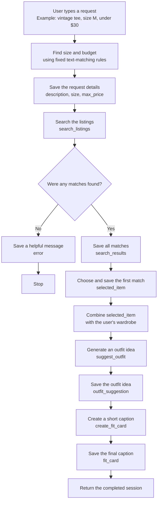

# FitFindr

> ### 👋 Start here
>
> **New to this repo? Read [RUNNING.md](RUNNING.md) first** — setup, every
> command, and what to do when something breaks.
>
> Once `python test.py` passes:
>
> ```bash
> python app.py listings --full -n 6      # read the data (Milestone 1)
> python app.py fields                    # what you can filter on
> python app.py ask 'vintage graphic tee under $30'
> ```
>
> All three tools are stubs, so that last command will do nothing useful yet.
> That's the starting position.
>
> **The rest of this file is your submission.** Fill it in as you go.

---

<!-- ─────────────────────────────────────────────────────────────────────────
     HOW TO USE THIS FILE

     This is your submission. Fill each section in as you finish the milestone
     it belongs to — don't leave it all to the end.

     Unit 3 asks for the first five sections. Unit 4 adds the five below them.
     Leave the unit 4 sections alone until then; they're here so you know
     what's coming.

     Everything is pasted as TEXT. No screenshots, no images, no video links.
     A typed block of output gets full credit; a picture of the same output
     gets none.
     ───────────────────────────────────────────────────────────────────────── -->

<!-- ═══════════════════════ UNIT 3 — THE BUILD ═══════════════════════ -->

## What This Does

<!-- Three or four sentences: what a user asks for, and what they get back. -->

FitFindr helps a user search secondhand clothing listings by describing what
they want and optionally including a size and maximum price. The agent parses
the request, searches the listings, and selects the best matching item. When a
match is found, it uses the user's wardrobe to suggest an outfit and creates a
short fit-card caption that includes the item's price and platform. If nothing
matches, it tells the user what they can change in their search and stops before
running the outfit and fit-card tools.

---

## Tool Inventory

<!-- Four lines per tool. This is worth 2 points and it's the single most
     common place students lose them.

     "Returns a list" earns NOTHING. The description has to say what is IN
     the list.

     The empty case isn't optional either — it's the thing your loop branches
     on, and if you don't decide it here you'll discover it as a crash in
     Milestone 5. -->

### `search_listings`

- **What it does:** Searches the local listings for description keywords, then optionally filters the results by size and an inclusive maximum price without calling the model.
- **Inputs:** 
  - `description` (`str`) contains the requested item keywords;
  -  `size` (`str | None`) is an optional, case-insensitive size filter; 
  -  `max_price` (`float | None`) is an optional inclusive price ceiling. Letter sizes are matched as complete size options, so `M` matches `S/M` but does not match `XL` or the `S` in `US 9`.
- **Returns:**
  -  A `list[dict]` of matching listings ordered from best keyword match to worst.
  -  Each listing includes `id`, `title`, `description`, `category`, `style_tags`, `size`, `condition`, `price`, `colors`, `brand`, and `platform`.
- **When it has nothing:** Returns an empty list (`[]`), rather than `None` or an exception.

### `suggest_outfit`

- **What it does:** Uses the selected thrift listing and the user's wardrobe to generate one or two outfit ideas, naming pieces the user already owns when they are available.
- **Inputs:**
  - `new_item` (`dict`) is the complete listing record for the item the user is considering.
  - `wardrobe` (`dict`) contains an `items` key whose value is a `list[dict]` of saved wardrobe pieces; the list may be empty.
- **Returns:** A non-empty `str` containing one or two outfit suggestions built around `new_item` and, when possible, specific pieces from the user's wardrobe.
- **When it has nothing:** If `wardrobe["items"]` is empty, it returns non-empty general styling advice for `new_item` instead of raising an error or returning an empty string.

### `create_fit_card`

- **What it does:** Turns an outfit suggestion and its thrift listing into a short, social-media-style caption with a specific fashion vibe.
- **Inputs:**
  - `outfit` (`str`) is the suggestion produced by `suggest_outfit`.
  - `new_item` (`dict`) is the complete listing record for the selected thrift item.
- **Returns:** A `str` containing a two-to-four-sentence caption that mentions the item, its price, and its platform once each and incorporates the suggested outfit.
- **When it has nothing:** If `outfit` is empty or contains only whitespace, it returns a descriptive message instead of raising an error or attempting to create a caption.

---

## Planning Loop

<!-- Your branch rule, stated as a rule — the condition AND both paths — plus
     the file and function that holds it.

     Like this:
       "If search_listings returns an empty list, put a message in the session
        and stop. Otherwise take the first result and go to suggest_outfit."
        — agent.py::run_agent

     The grader checks your code against what you claim here, so the file and
     function have to be real. -->

**Branch rule:** If `search_listings` returns an empty list, store an actionable message in `session["error"]` and stop. Otherwise, store the first result in `session["selected_item"]` and continue to `suggest_outfit`.

**Where it lives:** `agent.py::run_agent`

**How the query is parsed:** The program uses regular expressions (text-matching patterns) to find a size and a budget in the user's request. For example, it reads `size M` as the size and `under $30` as the maximum price. It removes those parts, then uses the words left over as the item description. This step follows fixed rules and does not use the AI model.

**What moves through the session:** The session is the shared record of one request. It first saves what the user typed (`query`) and the three details taken from it (`description`, `size`, and `max_price` inside `parsed`). Next it saves the matching listings (`search_results`) and chooses the first one (`selected_item`). The selected item and the user's wardrobe are used to save an outfit idea (`outfit_suggestion`), and that idea becomes the final caption (`fit_card`). If there are no matching listings, the session saves a helpful message (`error`) and stops before creating an outfit or caption.



---

## Sample Run

<!-- Two things go here.

     1. One FULL query and its output, pasted as text.
     2. Your three per-tool terminal tests — the command and what it printed. -->

**One full query**

```
$ .\.venv\Scripts\python.exe app.py ask 'vintage graphic tee size M under $30'

  Found:    Y2K Baby Tee — Butterfly Print — $18.0 on depop

  Outfit:   Outfit 1:
- Top: Y2K Baby Tee — Butterfly Print
- Bottoms: Baggy straight-leg jeans, dark wash
- Shoes: Chunky white sneakers
- Accessories: Black crossbody bag

Why it works: The fitted crop of the baby tee balances the volume of the baggy dark-wash jeans, creating a classic Y2K proportion. The pink and purple butterfly graphic ties into the streetwear aesthetic of the sneakers and bag.

Outfit 2:
- Top: Y2K Baby Tee — Butterfly Print
- Outerwear: Vintage black denim jacket
- Bottoms: Wide-leg khaki trousers
- Shoes: Black combat boots
- Accessories: Brown leather belt

Why it works: Layering the slightly cropped black denim jacket over the baby tee brings out the Y2K vibe while contrasting against the minimal khaki trousers. The combat boots add an edgy contrast to the soft butterfly graphic.

  Fit card: Channel total early-2000s energy by styling this Y2K butterfly baby tee with baggy dark-wash jeans and chunky white sneakers for the ultimate nostalgic streetwear look. Available now for $18.00 on depop, this fitted gem adds a sweet pop of color to any casual rotation.

0 model calls this session, 2 served from cache
```

**The three tools, tested one at a time**

```
$ .\.venv\Scripts\python.exe -c "from tools import search_listings; print([(item['title'], item['price']) for item in search_listings('graphic tee', max_price=30)])"
[('Y2K Baby Tee — Butterfly Print', 18.0), ('Graphic Tee — 2003 Tour Bootleg Style', 24.0), ('Mesh Long-Sleeve Top — Black', 15.0), ('Vintage Band Tee — Faded Grey', 19.0), ('Low-Rise Cargo Pants — Khaki', 27.0), ('Oversized Crewneck Sweatshirt — Vintage Navy', 20.0), ('Vintage Graphic Hoodie — Faded Black', 26.0)]
```

```
$ .\.venv\Scripts\python.exe -c "from tools import suggest_outfit; from utils.data_loader import get_example_wardrobe, load_listings; print(' '.join(suggest_outfit(load_listings()[0], get_example_wardrobe()).split()))"
Outfit 1: - Bottoms: Vintage Levi's 501 Jeans — Medium Wash - Tops: White ribbed tank top - Outerwear: Vintage black denim jacket - Shoes: Chunky white sneakers - Accessories: Black crossbody bag Why it works: The medium wash of the Levi's pairs effortlessly with the crisp white tank for a classic, minimal base. Adding the slightly cropped black denim jacket introduces a cool double-denim contrast without clashing, while the chunky white sneakers and black crossbody bag tie the streetwear aesthetic together. Outfit 2: - Bottoms: Vintage Levi's 501 Jeans — Medium Wash - Tops: Oversized grey crewneck sweatshirt - Shoes: Black combat boots - Accessories: Brown leather belt Why it works: The straight-leg fit of the 501s balances the heavy, hip-dropping proportions of the oversized grey crewneck. Tucking the front of the sweatshirt in with the brown leather belt adds definition, and the black combat boots ground the look with a touch of grunge edge.
```

```
$ .\.venv\Scripts\python.exe -c "from tools import create_fit_card; from utils.data_loader import load_listings; print(' '.join(create_fit_card('jeans and white sneakers', load_listings()[0]).split()))"
Channel effortless streetwear energy with these vintage Levi's 501 jeans, featuring a perfectly faded medium wash that screams authentic retro cool. Pair them with crisp white sneakers for an easy, everyday look that never misses. You can grab this timeless wardrobe staple on depop for just $38.00.
```

---

## How I Used AI

<!-- Two specific moments. What you asked, what came back, what you changed.

     "I used Claude to help me code" is not enough.

     "I gave Claude my search_listings spec. It returned None on no match
     instead of an empty list, so I changed it" is the level we want. -->

**Moment 1**

- *What I asked for:* I showed Codex my tool
  contract and the different size formats in the data, including `M`, `S/M`,
  `XL`, `US 8`, `US 8.5`, and `W30 L30`. I asked how to make matching ignore
  capitalization without accidentally letting size `S` match the `S` in
  `US 9`, or size `L` match `XL`.
- *What came back:* Codex explained that a simple check such as
  `requested_size in listing_size` would quietly return incorrect sizes. It
  recommended converting sizes to a consistent format and matching complete
  size options instead of individual letters. It also recommended cleaning the
  description into useful keywords, applying the price and size filters before
  scoring, ranking listings by the number of matching keywords, and returning
  exactly `[]` when nothing matches.
- *What I changed:* I added `_size_matches()` to handle letter, shoe, and waist
  sizes without partial-letter mistakes. I added `_keyword_tokens()` to ignore
  capitalization, punctuation, filler words, and simple plural differences.
  The search now removes over-budget and wrong-size listings first, ranks the
  remaining listings, and returns the original listing dictionaries in order.
  I tested `S`, `M`, `US 8`, a maximum price, and an impossible search. These
  changes help because the user now gets results that actually respect their
  filters, and the agent receives a dependable empty list when it needs to stop.

**Moment 2**

- *What I asked for:* I asked Codex how to
  connect the three tools so the agent would continue after a successful search
  but stop after an empty search. I also asked how to keep the selected item and
  every later result visible so I could check that the same item moved through
  the whole workflow.
- *What came back:* Codex suggested using a `next_step` value to track which
  part of the workflow should run, plus an iteration counter to stop a broken
  loop from repeating forever. It suggested using regular expressions, which
  are fixed text-matching rules, to separate the item description, size, and
  maximum price without spending a model call. It also recommended saving each
  result in the session and returning early with a useful message if search
  returns `[]`.
- *What I changed:* I added `_parse_query()` so a request such as
  `vintage tee size M under $30` becomes a description, size `M`, and maximum
  price `30.0`. I built a bounded planning loop that saves `search_results`,
  `selected_item`, `outfit_suggestion`, and `fit_card` in the session, and each
  tool reads its input back from that shared session. For the empty branch, I
  added a message telling the user to broaden the keywords, remove the size, or
  increase the budget, then stopped before either model-powered tool ran. I
  tested both paths: the happy path completed all three tools with the same item
  ID, while the empty path left `fit_card` as `None` and made zero model calls.
  This makes the agent's decisions visible, testable, and less likely to waste
  API requests.

<!-- ═══════════════════════ UNIT 4 — THE TEST ═══════════════════════

     Don't fill these in during unit 3.
     ═══════════════════════════════════════════════════════════════════ -->

---

## Run Log — Before

<!-- Five criteria, five tries each, in this exact format.

     Five, because your criteria are written out of five. Mark each try PASS
     or FAIL, count the passes, and read that count against your target — a
     row targeting 4 of 5 with three PASS cells is MISSED (3/5).

     `python run_eval.py --label before` runs everything and writes the table
     into results/. Paste it here and fill in the verdicts. -->

| Criterion | Target | Try 1 | Try 2 | Try 3 | Try 4 | Try 5 | Verdict |
|---|---|---|---|---|---|---|---|
| 1.  |  |  |  |  |  |  |  |
| 2.  |  |  |  |  |  |  |  |
| 3.  |  |  |  |  |  |  |  |
| 4.  |  |  |  |  |  |  |  |
| 5.  |  |  |  |  |  |  |  |

**Real output from one try**, pasted as text, naming the file and function
that produced it:

```

```

---

## Verdicts and Diagnoses

<!-- MET or MISSED per criterion against LAST UNIT's target, plus a sentence on
     how you decided.

     Then, for every miss: which of the four places it happened — a tool, the
     loop's branch, the session, or the model's output — AND the mechanism.

     Not a diagnosis:  "The fit card was bad."
     A diagnosis:      "The fit card criterion missed on 2 of 5 items. Both had
                        an empty brand field. My prompt puts the brand in the
                        first sentence, so the card opened with a blank and read
                        like a fragment. The tool worked; the prompt assumed a
                        field that isn't always there."

     Look for a pattern. Three misses on the same tool is one problem, not
     three. -->

| # | Criterion | Target | Verdict | How I decided |
|---|---|---|---|---|
| 1 |  |  |  |  |
| 2 |  |  |  |  |
| 3 |  |  |  |  |
| 4 |  |  |  |  |
| 5 |  |  |  |  |

**Diagnoses**


---

## Loop Trace

<!-- One full run, printed step by step, with the MCP call visible in it.

     `python app.py ask '...' --trace` once you've added the trace.step()
     calls in Milestone 2.

     Worth pasting BOTH the happy path and the empty-search path. The empty
     one should be visibly shorter, because it stops. If your two traces are
     the same length, your branch isn't working — and this is the fastest way
     anyone will ever find that out. -->

**Happy path**

```

```

**Empty search**

```

```

**On the MCP move:** <!-- what changed in your code, and whether anything
behaved differently afterwards. If the rewire didn't work, say exactly where it
broke — the error text and the last thing that worked. That earns the point in
full. -->


---

## The Improvement

<!-- What you changed, why your diagnosis pointed at it, and the after-run in
     the same table format. One change, measured properly.

     `python run_eval.py --label after` -->

**What I changed:**

**Which failure it was meant to fix:**

### Run Log — After

| Criterion | Target | Try 1 | Try 2 | Try 3 | Try 4 | Try 5 | Verdict |
|---|---|---|---|---|---|---|---|
| 1.  |  |  |  |  |  |  |  |
| 2.  |  |  |  |  |  |  |  |
| 3.  |  |  |  |  |  |  |  |
| 4.  |  |  |  |  |  |  |  |
| 5.  |  |  |  |  |  |  |  |

**Did it help, and how do I know:**

<!-- If it made things worse, say that. Honestly reported, that earns full
     credit and is more interesting than one that worked. -->


---

## What's Still Broken

<!-- For each criterion still missed: what you'd do, and why you stopped where
     you did. "I ran out of time" is fine if it's true. Pretending nothing is
     left is not. -->


<!-- ═════════════════════════════════════════════════════════════════════

     SUBMISSION CHECKLIST — unit 3

       [ ] criteria.md has five numbered criteria, each with a target
       [ ] Each criterion has a reason underneath it
       [ ] All five unit 3 sections above have real content
       [ ] Tool Inventory: all three tools, inputs WITH TYPES, a specific
           return value, and the empty case
       [ ] Planning Loop names the branch rule and agent.py::run_agent
       [ ] Sample Run: one full query plus the three per-tool tests, as text
       [ ] At least four new commits
       [ ] Repository URL submitted — WRITE IT DOWN, you submit the same one
           next unit

     SUBMISSION CHECKLIST — unit 4

       [ ] mcp_server.py exists with one tool registered
           (or a written record of exactly where the rewire broke)
       [ ] Run Log — Before, five criteria, five tries each
       [ ] Real output pasted underneath, naming file and function
       [ ] A verdict on every criterion
       [ ] A diagnosis for every miss, naming a place AND a mechanism
       [ ] Loop Trace, with the MCP call visible in it
       [ ] All three failure modes triggered and handled
       [ ] One improvement, with Run Log — After in the same format
       [ ] What's Still Broken
       [ ] At least four new commits
       [ ] The SAME repository URL as last unit

     Do not delete and recreate this repository. Your commit history is what
     shows your criteria existed before your results did.
     ═════════════════════════════════════════════════════════════════════ -->

---

📖 **How to run this project: [RUNNING.md](RUNNING.md)**
